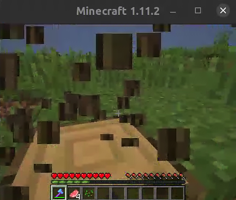
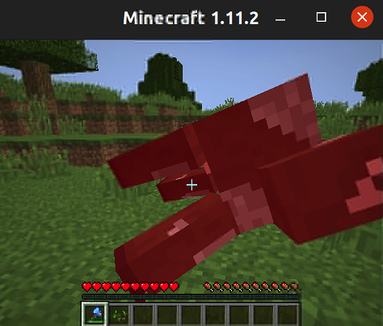

# Open-World Multi-Task Control Through Goal-Aware Representation Learning and Adaptive Horizon Prediction

<div align="center">

[[Website]]()
[[Arxiv Paper]](https://arxiv.org/pdf/2301.10034.pdf)
[[Team]](https://github.com/CraftJarvis)

[](https://pypi.org/project/MineDojo/)
[](https://pytorch.org/)
[](https://github.com/MineDojo/MineCLIP/blob/main/license)
______________________________________________________________________

</div>

## Preparation
Our codebase require Python ≥ 3.9. 
It also requires a [modified version of MineDojo](https://github.com/CraftJarvis/MC-Simulator) as the simulator and [MineCLIP](https://github.com/MineDojo/MineCLIP) as the goal text encoder. 
Please run the following commands to prepare the environments. 
```sh
conda create -n controller python=3.9 
conda activate controller
python -m pip install numpy torch==2.0.0.dev20230208+cu117 --index-url https://download.pytorch.org/whl/nightly/cu117
python -m pip install -r requirements.txt
python -m pip install git+https://github.com/MineDojo/MineCLIP
python -m pip install git+https://github.com/CraftJarvis/MC-Simulator.git
```

## Dataset
|Biome|Size|Download|
|---|---|---|
|Plains| 289GB | to be uploaded |
|Flat| 553GB | to be uploaded |
|Forests | 215GB | to be uploaded |

## Train Agent
Run the following commands to train the agent. 
```sh
python main.py data=multi_plains eval=multi_plains
```
We have provided three configure files for three biomes (multi_plains, multi_forests, and multi_flat). 
## Running agent models
To run the code, call 
```sh
python main.py eval=multi_plains eval.only=True model.load_ckpt_path=<path/to/ckpt>
```
After loading, you should see som windows where agents are playing Minecraft. 



## Model checkpoints
Below are the configures and weights of models. 
|Configure|Download| Biome| Number of goals|
|---|---|---|---|
|Transformer | here | Plains | 4 |
|Transformer + Extra Observation| [here](https://k00.fr/zx0liyzq) | Plains | 4 |

For example, if we want to use the "Transformer+Extra Observation" checkpoint, we should specify `model=transformer_w_extra` in the command. 
```sh
python main.py eval=multi_plains eval.only=True model=transformer_w_extra model.load_ckpt_path=<path/to/ckpt>
```

## Paper and Citation
Our paper is posted on [Arxiv](https://arxiv.org/pdf/2301.10034.pdf). If it helps you, please consider citing us!
```bib
@article{cai2023open,
  title={Open-World Multi-Task Control Through Goal-Aware Representation Learning and Adaptive Horizon Prediction},
  author={Cai, Shaofei and Wang, Zihao and Ma, Xiaojian and Liu, Anji and Liang, Yitao},
  journal={arXiv preprint arXiv:2301.10034},
  year={2023}
}
```